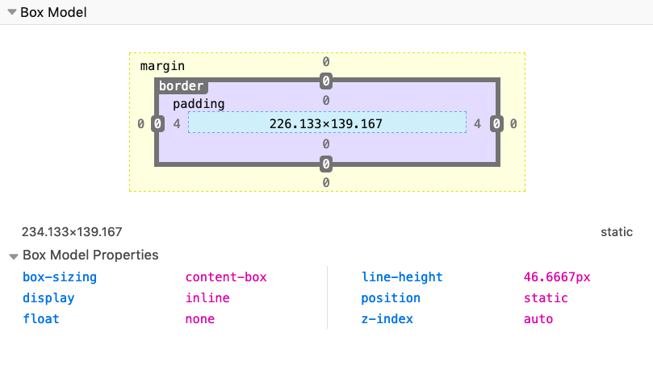

# More CSS

## Table of Contents <!-- omit in toc -->

- [Box Model](#box-model)
- [Border](#border)
- [Margin and Padding](#margin-and-padding)
- [Box sizing](#box-sizing)
- [Display](#display)
- [Positioning](#positioning)
- [Floating](#floating)
- [Tables](#tables)
- [Centering](#centering)
- [Lists](#lists)
- [Filters](#filters)
- [Typography](#typography)
- [Error handling](#error-handling)
- [Custom Properties](#custom-properties)


## Box Model

- every CSS eleement is essentially a box, every element is a generic box
- box model explains the sizing of the elements based on a few CSS properties
  - content area
  - padding
  - border
  - margin
- by default, if you set a width/height on the element, it's gonna be applied on the **content area**




## Border

- border is a thin layer between padding and margin 
  - editing the border can make elements draw their perimeter on screen
- work on border using these properties:
  - `border-style` property lets us choose the style of the border
    - options are: `dotted`, `dashed`, `solid` which is mostly used, `double`, `groove`, `ridge`, `inset`, `outset`, `hidden`, and `none` is the default
    - set a different style for each edge using the properties:
      - `border-top-style`
      - `border-right-style`
      - `border-bottom-style`
      - `border-left-style`
  - `border-color` is used to set the color of the border, by default uses the color of the text in the element
  - `border-width` is used to set the width of the border, pre-defined values are:
    - `thin`
    - `medium` (default value)
    - `thick`
    - or express values in pixels, em, rem or any other valid length value
- `border` property is a shorthand for `border-width`, `border-style`, `border-color`
  - can also use edge-specific properties: `border-top`, `border-right`, `border-bottom`, `border-left`
- `border-radius` is used to set rounded corners to the border
- `border-image` has ability to use images as borders, and a shorthand property for
  - `border-image-source`
  - `border-image-slice`
  - `border-image-width`
  - `border-image-outset`
  - `border-image-repeat`


## Margin and Padding

**Note**:

- `margin` property adds space outside an element border
- `padding` property adds space inside an element border

### Specific margin/padding properties

- `margin-top` and `padding-top`
- `margin-right` and `padding-right`
- `margin-bottom` and `padding-bottom`
- `margin-left` and `padding-left`

### Using the margin/padding shorthand

`margin` and `padding` is a shorthand to specify multiple margins/paddings at the same time, and depending on the number of values entered, it behaves differently.

- **1 value** applies to **all** the margins/paddings: top, right, bottom, left.
- **2 values** applies the first to **bottom & top**, and the second to **left & right**
- **3 values** applies the first to **top**, the second to **left & right**, the third to **bottom**
- **4 values** applies the first to **top**, the second to **right**, the third to **bottom**, the fourth to **left**

### Values accepted

- `margin`/`padding` accepts values expressed in any kind of length unit, the most common ones are px, em, rem, but [many others exist](https://developer.mozilla.org/en-US/docs/Web/CSS/length)
- `margin` also accepts percentage values, and `auto` which is calculated by the browser

### Using auto to center elements

- `auto` can be used to tell the browser to select automatically a margin, which is commonly used to center an element
- using Flexbox, its `justify-content: center;`
- set `margin: 0 auto;` to support older browsers that does not implement Flexbox

### Using a negative margin

- `margin` is the only property related to sizing that can have a negative value
- setting a negative`margin-top` makes an element move over elements before it, and given enough negative value it will move out of the page
- negative `margin-bottom` moves up the elements after it
- negative `margin-right` makes the content of the element expand beyond its allowed content size
- negative `margin-left` moves the element left over the elements that precede it, and given enough negative value it will move out of the page


## Box sizing

- by default, browsers applied width and height to the **content area**, without taking any of the padding, border and margin in consideration
- can change this behavior using `box-sizing` property
  - `content-box` is the default
  - `border-box` will set width and height calculation include the padding and border
    - margin is outside of the box
- CSS Tricks declared an [international box-sizing awareness day](https://css-tricks.com/international-box-sizing-awareness-day/)
- it's recommended to apply it to every element on the page

  ```css
  *, *:before, *:after {
    box-sizing: border-box;
  }
  ```


## Display

- `display` property of an object determines how it is rendered by the browser
  - block
  - inline
  - none
  - table
  - flex
  - grid

### `inline`

- `inline` is the default display value for every element in CSS
- inline elements don't have any `margin`, `padding`, `height` and `width` applied

### `block`

- HTML tags are displayed inline except some elements, which are set as `block` by the user agent (browser)
  - `div`
  - `p`
  - `section`
  - `ul`
- `display: block`, elements are stacked one after each other, vertically, and every element takes up 100% of the page
- values assigned to the `width` and `height` properties are respected, if set them, along with `margin` and `padding`

### `none`

- `display: none` makes an element disappear
  - still there, but not visible in the browser


## Positioning

- positioning is what makes us determine where elements appear on the screen, and how they appear
- position property has 5 values:
  - `static`
  - `relative`
  - `absolute`
  - `fixed`
  - `sticky`

e.g., parent container, child container, and an inner box with some text:

```html
<div class="parent">
  <div class="child">
    <div class="box">
      <p>Test</p>
    </div>
  </div>
</div>
```

with CSS to give some colors and padding, but does not affect positioning:

```css
.parent {
  background-color: #af47ff;
  padding: 30px;
  width: 300px;
}

.child {
  background-color: #ff4797;
  padding: 30px;
}

.box {
  background-color: #f3ff47;
  padding: 30px;
  border: 2px solid #333;
  border-style: dotted;
  font-family: courier;
  text-align: center;
  font-size: 2rem;
}
```

### `static`

- `static` is the default value for an element
  - displayed in the normal page flow

### `relative`

- element set on `relative` are now able to position it relatively to the element containing it with an **offset properties** which accept a length value or a percentage:
  - `top`
  - `right`
  - `bottom`
  - `left`

  ```css
  .box {
    /* ... */
    position: relative;
    top: -60px;
    left: 180px;
  }
  ```

- a negative value for top will make the box move up relatively to its container
- notice how the space that is occupied by the box remains preserved in the container, like it was still in its place

### `absolute`

- element set on `absolute` will remove it from the document's flow, and no longer follow the page positioning flow
- can use `top`, `right`, `bottom`, `left` properties
- original space is collapsed, and only the origin (x, y coordinates) remain the same

  ```css
  .box {
    /* ... */
    position: absolute;
    /* top: 0px;
    left: 0px; */
    top: 140px;
    left: 50px;
  }
  ```

- the coordinates are relative to the closest container that is not static
- adding `position: relative` to the `.child` element and setting `top` and `left` to 0, the box will not be positioned at the top left margin of the _window_, but rather it will be positioned at the 0, 0 coordinates of `.child`

  ```css
  .child {
    /* ... */
    position: relative;
  }

  .box {
    /* ... */
    position: absolute;
    top: 0px;
    left: 0px;
  }
  ```

- 

### `fixed`

- element set on `fixed` will remove it from the document's flow, and no longer follow the page positioning flow
- difference with `absolute` positioning:
  - elements are now always positioned relative to the window, instead of the first non-static container
  - elements are not affected by scrolling
    - once put a fixed element somewhere, scrolling the page does not remove it from the visible part of the page

  ```css
  .box {
    /* ... */
    position: fixed;
    top: 0;
    left: 0;
  }
  ```

### `sticky`

- `sticky` was only introduced recently and it's still relatively unsupported, [see caniuse.com](https://caniuse.com/#feat=css-sticky)
- when you scroll in the contacts list and the first letter is sticked to the top, to let you know you are viewing that particular letter's contacts
- we used JavaScript to emulate that, but this is the approach taken by CSS to allow it natively


## Floating

- was used in lots of hacks and creative usages along with tables, to implement some layouts
  - float the sidebar to the left, e.g., to show it on the left side of the screen and added some margin to the main content
- today we have Flexbox and Grid to help us with layout
  - and float can go back to its original scope: placing content on one side of the container element, and make its siblings show up around it
- `float` property supports 3 values:
  - `left`
  - `right`
  - `none` (default)

- e.g., a box which contains a paragraph with some text, and the paragraph also contains an image

  ```html
  <div class="parent">
    <div class="child">
      <div class="box">
        <p>This is some random paragraph and an image.  The image is in the middle of the text. The image is in the middle of the text. The image is in the middle of the text. The image is in the middle of the text. The image is in the middle of the text. The image is in the middle of the text. The image is in the middle of the text. The image is in the middle of the text. The image is in the middle of the text.
        </p>
      </div>
    </div>
  </div>
  ```

  ```css
  .parent {
    background-color: #af47ff;
    padding: 30px;
    width: 500px;
  }

  .child {
    background-color: #ff4797;
    padding: 30px;
  }

  .box {
    background-color: #f3ff47;
    padding: 30px;
    border: 2px solid #333;
    border-style: dotted;
    font-family: courier;
    text-align: justify;
    font-size: 1rem;
  }
  ```

- the normal flow by default considers the image inline, and makes space for it in the line itself
- adding `float: left` to the image, and some `padding`:

  ```css
  img {
    float: left;
    padding: 20px 20px 0px 0px;
  }
  ```

- adding `float: right`, adjusting the padding accordingly:

  ```css
  img {
    float: right;
    padding: 20px 0px 20px 20px;
  }
  ```

- a floated element is removed from the normal flow of the page, and the other content flows around it


### Clearing

- when floating more than one element
- if when floated they find another floated image, by default they are stacked up one next to the other, horizontally
  - until there is no room, and they will start being stacked on a new line
- `clear: left` to images, these are going to be stacked vertically rather than horizontally
  - `left` to clear left floats
  - `right` to clear right floats
  - `both` to clear both left and right floats
  - `none` (default) disables clearing


## Tables

- tables in the past were greatly overused in CSS, to create layout
- today with Grid and Flexbox, tables can go back to the job they were intended to do: styling tables

  ```html
  <table>
    <thead>
      <tr>
        <th scope="col">Name</th>
        <th scope="col">Age</th>
      </tr>
    </thead>
    <tbody>
      <tr>
        <th scope="row">Flavio</th>
        <td>36</td>
      </tr>
      <tr>
        <th scope="row">Roger</th>
        <td>7</td>
      </tr>
    </tbody>
  </table>
  ```

- by default, browser provides some standard styles
- we can use CSS to style all the elements of the table
- applying border to the `table`, `th` and `td`

  ```css
  table, th, td {
    border: 1px solid #333;
  }
  ```

- tables has ability to add a color to one row, and a different color to another row
  - using the `:nth-child(odd)` or `:nth-child(even)` selector:

  ```css
  tbody tr:nth-child(odd) {
    background-color: #af47ff;
  }
  ```

- adding `border-collapse: collapse;` to the `table` element, all borders are collapsed into one


## Centering

- text can be center horizontally using the `text-align` property set to `center`:

  ```css
  p { text-align: center; }
  ```

- blocks or anything that is not text can be centered by automatic margin to left and right, and setting the width of the element:

  ```css
  section {
    margin: 0 auto;
    width: 50%;
  }
  ```

- `margin: 0 auto` is a shorthand margin for top and bottom to 0, then left and right to auto
- **Note**: Set item to `display: block` if it's an inline element


## Lists

- `list-style-type` is used to set a predefined marker to be used by the list
  - most popular values are `disc`, `circle`, `square` and `none`
- `list-style-image` is used to use a custom marker when a predefined marker is not appropriate
- `list-style-position` lets us add the marker outside (default) or inside of the list content, in the flow of the page rather than outside of it
- `list-style` is a shorthand property to specify all those properties in the same line

  ```css
  li { list-style: url(list-image.png) inside; }
  ```


## Filters

- `filter` property allows us to perform operations on elements, e.g., changing opacity, brightness and more
- `blur()` applies a blur effect on a element content
  - can pass a px, em or rem value for blur radius
- `opacity()` takes one value from 0 to 1, or a percentage for the transparency
- `grayscale()` will make the element have a gray color, accepts one value from 0 to 1 or 0% to 100%
- `sepia()` will make the element have a sepia color, accepts one value from 0 to 1 or 0% to 100%
- `invert()` will nvert the colors of an element, accepts from 0 to 1 or 0% to 100%
  - looking up the opposite of a color in the HSL color wheel, e.g., yellow to blue, red to cyan
- `brightness()` alters the brightness of an element
  - 0 or 0% gives a total black element
  - 1 or 100% gives an unchanged image
  - higher than 1 or 100% make the image brighter up to reaching a total white element
- `contrast()` alters the contrast of an element
  - 0 or 0% gives a total gray element
  - 1 or 100% gives an unchanged image
  - values higher than 1 or 100% give more contrast
- `saturate()` alters the saturation of an element
  - 0 or 0% gives a total grayscale element (less saturation)
  - 1 or 100% gives an unchanged image
  - values higher than 1 or 100% give more saturation


## Typography

- `text-transform` property can transform case of an element
  - `capitalize` to uppercase the first letter of each word
  - `uppercase` to uppercase all the text
  - `lowercase` to lowercase all the text
  - `none` to disable transforming the text, used to avoid inheriting the property
- `text-decoration` property adds a decorations to the text
  - `underline`, `overline`, `line-through`, `blink`, `none`
  - can also set the style and color
  - valid style values are `solid`, `double`, `dotted`, `dashed`, `wavy`

  ```css
  p { text-decoration: underline dashed yellow; }
  ```

- `text-align` property has possible values `start` (default), `end`, `left`, `right`, `center`, `justify` (nice to have a consistent spacing at the line ends)
- `line-height` property allows us to change the height of a line

  ```css
  p { line-height: 0.9rem; }
  ```

## Error handling

- in CSS if a line has an error, it skips it and jumps to the next line without any error, e.g., forgetting semicolons
- [CSS Lint](http://csslint.net/)  tool exist


## Custom Properties

- CSS is not a programming language, has a declarative syntax to tell browsers how to display an HTML page
  - variable is a name that refers to a value, which helps reduce repetition and inconsistencies
- CSS variable is defined by prepending **two dashes** to a name (`--variable-name`), then a colon and a value
  - variable value can be any valid CSS value

    ```css
    :root {
      --primary-color: yellow;
    }
    ```

  - access the variable value using `var()`

    ```css
    p {
      color: var(--primary-color)
    }
    ```

- CSS variables can be defined inside any element
  - **scope** is what changes between declarations
- variable scope
  - adding variables to a selector makes them available to its children
  - in the context of an HTML document, `:root` selector points to the html element
  - in the context of an SVG image, `:root` points to the `svg` tag
  - adding a CSS to `:root` makes it available to all the elements in the page
  - variables can be **reassigned**:

    ```css
    :root { --primary-color: yellow; }
    .container { --primary-color: blue; }
    ```

  - outside `.container`, `--primary-color` will be _yellow_, but inside it will be _blue_
  - can also assign or overwrite a variable inside the HTML using **inline styles**

    ```html
    <main style="--primary-color: orange;">
      <!-- ... -->
    </main>
    ```

- CSS variables follow the normal CSS cascading rules, with precedence set according to specificity

- CSS variables are case sensitive
- `var()` accepts a second parameter, which is the default fallback value when the variable value is not set:

  ```css
  .container { margin: var(--default-margin, 30px); }
  ```
