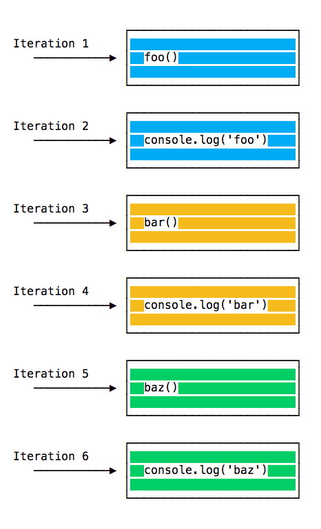
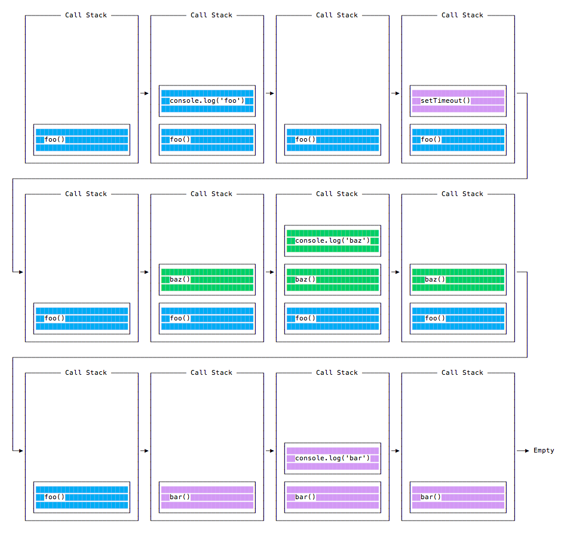

# The Event Loop

## Table of Contents <!-- omit in toc -->

- [Introduction](#introduction)
- [A practical example with code](#a-practical-example-with-code)
- [Queuing Function Execution](#queuing-function-execution)
- [Promises in the event loop](#promises-in-the-event-loop)
- [Additional Resources](#additional-resources)


## Introduction

- **Event Loop** is one of the most important aspects to understand about JS
  - order of instructions is not executed from top to bottom
  - functions invoked might be executed later than we might expect
- JS code runs single threaded, meaning it execute the codes one thing at a time
- **Note**: Avoid anything that could **block the thread**, e.g., synchronous network calls, or accessing files, and any other things that might take a lot of time to complete
  - JS does that using the **event loop**, when we call an asynchronous function in JS, that is queued into the event loop, and will only be executed when its turn comes
- browsers create an event loop for every browser tab
  - to make every process isolated from each other
  - and avoid a web page with infinite loops or heavy processing to block the entire browser
    - same happens for every Node.js program we run
  - sometimes API calls also run in their own event loop
    - **Web Workers** run in their own event loop as well
- any JS code that takes too long to return back control to the event loop will be blocked
  - even block the UI thread, and the user cannot click around, scroll the page, and so on
- almost all the I/O primitives in JS are non-blocking
  - network requests, Node.js filesystem operations, and so on
  - being blocking is the exception, and this is why JS is based so much on callbacks, and more recently on promises and async/await


## A practical example with code

- code runs the `foo()`  first, inside it will call `bar()`, then will call `baz()`

```js
const bar = () => console.log('bar');
const baz = () => console.log('baz');
const foo = () => {
  console.log('foo');
  bar();
  baz();
};

foo();
// Output:
// foo
// bar
// baz
```

- call stack looks like this:

  

- event loop on every iteration looks like this if there's something in the call stack, and executes it until the call stack is empty

  


## Queuing Function Execution

- `setTimeout(() => {}), 0);` is used to call a function, but execute it once every other function in the code has executed
- code will run the `foo()` first, inside it will call `setTimeout` passing `bar()` as an argument, and instruct it to run immediately as fast as it can, passing 0 as the timer, then will call `baz()`

  ```js
  const bar = () => console.log('bar');
  const baz = () => console.log('baz');
  const foo = () => {
    console.log('foo');
    setTimeout(bar, 0);
    baz();
  };

  foo();
  // Output:
  // foo
  // baz
  // bar
  ```

- call stack looks like this:
  
  

- execution order for all the functions in the program:

  


## Promises in the event loop

- Promises use a concept called Job Queue
  - a way to execute the result of an asynchronous function ASAP, than being put at the end of the call stack
- promises that resolve before the current function ends will be executed right after the current function
- **Analogy** of a rollercoaster ride:
  - message queue puts you at the back of the queue, behind all the other people, where you will have to wait for your turn,
  - while the job queue is the fastpass ticket that lets you take another ride right after you finished the previous one

  ```js
  const bar = () => console.log('bar');
  const baz = () => console.log('baz');
  const foo = () => {
    console.log('foo');
    setTimeout(bar, 0);
    new Promise((resolve, reject) =>
      resolve('should be right after baz, before bar')
    ).then(resolve => console.log(resolve));
    baz();
  };

  foo();
  // Output:
  // foo
  // baz
  // should be right after baz, before bar
  // bar
  ```

- that's a big difference between Promises (and Async/await, which is built on promises) and plain old asynchronous functions through `setTimeout()` or other platform APIs


## Additional Resources

- [What the heck is the event loop anyway?](https://youtu.be/8aGhZQkoFbQ) by Philip Roberts at JSConf EU
- [In The Loop](https://www.youtube.com/watch?v=cCOL7MC4Pl0) by Jake Archibald at JSConf.Asia
