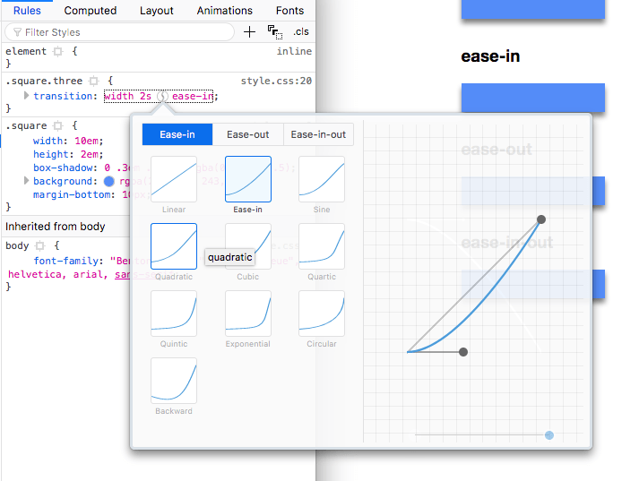

# CSS Transitions

## Table of Contents <!-- omit in toc -->

- [Introduction](#introduction)
- [Transition timing function values](#transition-timing-function-values)
- [CSS Transitions in Browser DevTools](#css-transitions-in-browser-devtools)
- [CSS properties we can animate using CSS Transitions](#css-properties-we-can-animate-using-css-transitions)


## Introduction

- CSS Transitions are the most simple way to create an animation in CSS
- in a transition, we change the value of a property, and we tell CSS to slowly change it according to some parameters, towards a final state
- `transition` property is a handy shorthand that can includes:
  - `transition-property`	is the CSS property that should transition
  - `transition-duration`	is the duration of the transition
  - `transition-timing-function` is the timing function used by the animation, e.g., `linear`, `ease` (default)
  - `transition-delay` accepts optional number of seconds to wait before starting the animation

```css
.container {
  transition: property
              duration
              timing-function
              delay;
}
```


## Transition timing function values

- `transition-timing-function` allows to specify the acceleration curve of the transition
  - `linear`
  - `ease`
  - `ease-in`
  - `ease-out`
  - `ease-in-out`
- we can create a completely custom timing function using [cubic bezier curves](https://developer.mozilla.org/en-US/docs/Web/CSS/single-transition-timing-function)


## CSS Transitions in Browser DevTools

The Browser DevTools offer a great way to visualize transitions.

Chrome:


Firefox:



From those panels we can live edit the transition and experiment in the page directly without reloading our code.


## CSS properties we can animate using CSS Transitions

- `background`
- `background-color`
- `background-position`
- `background-size`
- `border`
- `border-color`
- `border-width`
- `border-bottom`
- `border-bottom-color`
- `border-bottom-left-radius`
- `border-bottom-right-radius`
- `border-bottom-width`
- `border-left`
- `border-left-color`
- `border-left-width`
- `border-radius`
- `border-right`
- `border-right-color`
- `border-right-width`
- `border-spacing`
- `border-top`
- `border-top-color`
- `border-top-left-radius`
- `border-top-right-radius`
- `border-top-width`
- `bottom`
- `box-shadow`
- `caret-color`
- `clip`
- `color`
- `column-count`
- `column-gap`
- `column-rule`
- `column-rule-color`
- `column-rule-width`
- `column-width`
- `columns`
- `content`
- `filter`
- `flex`
- `flex-basis`
- `flex-grow`
- `flex-shrink`
- `font`
- `font-size`
- `font-size-adjust`
- `font-stretch`
- `font-weight`
- `grid-area`
- `grid-auto-columns`
- `grid-auto-flow`
- `grid-auto-rows`
- `grid-column-end`
- `grid-column-gap`
- `grid-column-start`
- `grid-column`
- `grid-gap`
- `grid-row-end`
- `grid-row-gap`
- `grid-row-start`
- `grid-row`
- `grid-template-areas`
- `grid-template-columns`
- `grid-template-rows`
- `grid-template`
- `grid`
- `height`
- `left`
- `letter-spacing`
- `line-height`
- `margin`
- `margin-bottom`
- `margin-left`
- `margin-right`
- `margin-top`
- `max-height`
- `max-width`
- `min-height`
- `min-width`
- `opacity`
- `order`
- `outline`
- `outline-color`
- `outline-offset`
- `outline-width`
- `padding`
- `padding-bottom`
- `padding-left`
- `padding-right`
- `padding-top`
- `perspective`
- `perspective-origin`
- `quotes`
- `right`
- `tab-size`
- `text-decoration`
- `text-decoration-color`
- `text-indent`
- `text-shadow`
- `top`
- `transform.`
- `vertical-align`
- `visibility`
- `width`
- `word-spacing`
- `z-index`
