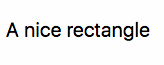
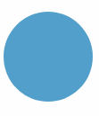
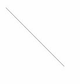
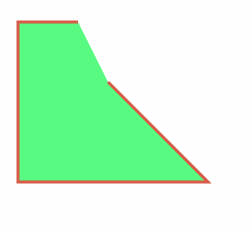
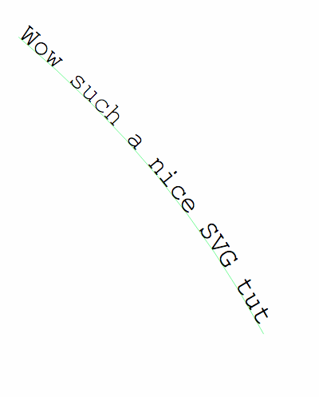
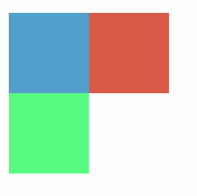
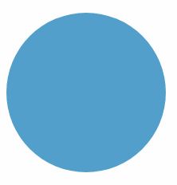
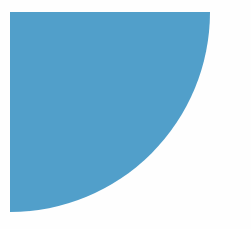

# SVG

## Table of Contents <!-- omit in toc -->

- [Introduction](#introduction)
- [The Advantages of SVG](#the-advantages-of-svg)
- [SVG Example](#svg-example)
- [Using SVG](#using-svg)
- [SVG Elements](#svg-elements)
- [SVG viewport and viewBox](#svg-viewport-and-viewbox)
- [Inserting SVG in Web Pages](#inserting-svg-in-web-pages)
- [Inline SVG using a Data URL](#inline-svg-using-a-data-url)
- [Styling elements](#styling-elements)
- [Interacting with a SVG with CSS or JS](#interacting-with-a-svg-with-css-or-js)


## Introduction

- Scalable Vector Graphics (SVG) is a **vector** image file format which is very different than image format such as PNG, GIF or JPG
  - supports variety of screen displays, at different resolutions and sizes
  - rapid decline of Flash in the last few years led to a renewed interest in SVG


## The Advantages of SVG

- being a vector images, it can **infinitely scale** and not have any issue on image quality degradation
  - because SVG images are built using **XML markup**
    - browser prints them by plotting each point and line, rather than filling some space with pre-defined pixels
    - this ensures SVG images can adapt to different screen sizes and resolutions, even ones that have yet to be invented
- being defined in XML, SVG images are much more **flexible** than JPG or PNG images
  - **we can also use CSS and JS to interact with them**
  - SVG images can even _contain_ CSS and JS
- can render vector-style images a lot smaller than other formats
  - mainly used on logos, illustrations and icons
- prefered by designers because they are smaller and they allow to have multi-color icons
- easy to animate
- provides some image editing effects, like masking and clipping, applying filters, and more
- SVG are just text, so it can be compressed using GZip


## SVG Example

- SVG has building blocks of vector images: `path`, `rect`, `line` and so on
  - pixels is the default unit

  ```html
  <svg width="10" height="10">
    <rect x="0" y="0" width="10" height="10" fill="blue" />
  </svg>
  ```

- use tools like Sketch or Figma or any other vector graphics tool to create the image, and export it as SVG
- SVG 1.1 is the current version, and SVG 2.0 is under development


## Using SVG

- SVG images can be displayed by the browser by including them in a `img` tag:

  ```html
  
  ```

- they can be directly included in the HTML page:

  ```html
  <!DOCTYPE html>
  <html>
    <head>
      <title>A page</title>
    </head>
    <body>
      <svg width="10" height="10">
        <rect x="0" y="0" width="10" height="10" fill="blue" />
      </svg>
    </body>
  </html>
  ```

- **Note**: HTML5 and XHTML require a different syntax for inline SVG images
  - XHTML is a thing of the past, but worth knowing in case we still need to work on XHTML pages
- the **ability to inline SVG in HTML** makes it very useful, as other images can't do this, and must be fetched by opening a separate request for each one


## SVG Elements

- SVG has a lot of different elements, these are the most used ones:
  - `text` creates a text element
  - `circle` creates a circle
  - `rect` creates a rectangle
  - `line` creates a line
  - `path` create a path between two points
  - `textPath` creates a path between two points, and a linked text element
  - `polygon` allows to create any kind of polygon
  - `g` groups separate elements
- coordinates start at 0,0 at the top-left of the drawing area, and extend _from left to right_ for `x`, _from top to bottom_ for `y`

### text

`text` element adds text, which text can be selected using the mouse. `x` and `y` define the starting point of the text.

```html
<svg>
  <text x="5" y="30">A nice rectangle</text>
</svg>
```




### circle

Define a circle. `cx` and `cy` are the center coordinates, and `r` is the radius. `fill` is a common attribute and represents the figure color.

```html
<svg>
  <circle cx="50" cy="50" r="50" fill="#529fca" />
</svg>
```



### rect

Defines a rectangle. `x` and `y` are the starting coordinates, then `width` and `height`.

```html
<svg>
  <rect x="0" y="0" width="100" height="100" fill="#529fca" />
</svg>
```


### line

`x1` and `y1` define the starting coordinates. `x2` and `y2` define the ending coordinates. `stroke` is a common attribute and represents the line color.

```html
<svg>
  <line x1="0" y1="0" x2="100" y2="100" stroke="#529fca" />
</svg>
```



### path

`path` is a sequence of lines and curves. It's the most powerful tool to draw using SVG, and as such it's the most complex.

`d` contains the directions commands. These commands start with the command name, and a set of coordinates:

- `M` means Move, it accepts a set of coordinates x, y
- `L` means Line, it accepts a set of coordinates x, y to draw the line to
- `H` is an Horizontal Line, it only accept an x coordinate
- `V` is a Vertical Line, it only accept an y coordinate
- `Z` means Close Path, puts a line back to the start
- `A` means Arch, it needs a whole tutorial on its own
- `Q` is a quadratic Bezier curve

```html
<svg height="300" width="300">
<path d="M 100 100 L 200 200 H 10 V 40 H 70"
    fill="#59fa81" stroke="#d85b49" stroke-width="3" />
</svg>
```



### textPath

`textPath` adds a text along the shape of a path element

```html
<svg viewBox="0 0 1000 600"
     xmlns="http://www.w3.org/2000/svg"
     xmlns:xlink="http://www.w3.org/1999/xlink">
  <defs>
    <path id="MyPath" d="M 20 40 Q 260 240 400 500" />
  </defs>
  <use xlink:href="#MyPath" fill="none" stroke="#59fa81" />
  <text font-family="Courier New" font-size="42.5">
    <textPath xlink:href="#MyPath">
    Wow such a nice SVG tut
    </textPath>
  </text>
</svg>
```



### polygon

Draw any random polygon with `polygon`. `points` represents a set of x, y coordinates the polygon should link:

```html
<svg>
  <polygon points="9.9, 1.1, 3.3, 21.78, 19.8, 8.58, 0, 8.58, 16.5, 21.78" />
</svg>
```


### g

Using the `g` element we can group multiple elements:

```html
<svg width="200" height="200">
  <rect x="0" y="0" width="100" height="100" fill="#529fca" />
  <g id="my-group">
    <rect x="0" y="100" width="100" height="100" fill="#59fa81" />
    <rect x="100" y="0" width="100" height="100" fill="#ad4a3d" />
  </g>
</svg>
```




## SVG viewport and viewBox

The size of an SVG relative to its container is set by the `width` and `height` attributes of the svg element. Those units default to pixels, but we can use any other usual units like `%` or `em`. This is the **viewport**.

Generally "container" means the browser window, but a `svg` element can contain other `svg` elements, in that case the container is the parent `svg`.

`viewBox` attribute lets us define a new coordinates system inside the SVG canvas

Simple circle, in a 200x200px SVG:

```html
<svg width="200" height="200">
  <circle cx="100" cy="100" r="100" fill="#529fca" />
</svg>
```



By specifying a `viewBox` we can choose to **only show a portion** of this SVG, e.g., we can start at point 0, 0 and only show a 100x100px canvas:

```html
<svg width="200" height="200" viewBox="0 0 100 100">
  <circle cx="100" cy="100" r="100" fill="#529fca" />
</svg>
```


starting at 100, 100 we will see another portion, the bottom right half of the circle:

```html
<svg width="200" height="200" viewBox="100 100 100 100">
  <circle cx="100" cy="100" r="100" fill="#529fca" />
</svg>
```



A great way to visualize this is to imagine Google Maps being a gigantic SVG image, and our browser is a viewBox as big as the window size. When we move around, the viewBox changes its starting point (x, y) coordinates, and when we resize the window, we change the width and height of the viewBox.


## Inserting SVG in Web Pages

- various ways to add SVG to a webpage:
  - with an `img` tag
  - ith the CSS `background-image` property
  - inline in the HTML
  - with an `object`, `iframe` or `embed` tag


### With an img tag

```html

```

### With the CSS background-image property

```html
<style>
  .svg-background {
    background-image: url(flag.svg);
    height: 200px;
    width: 300px;
  }
</style>
<div class="svg-background"></div>
```

### Inline in the HTML

```html
<svg width="300" height="200" viewBox="0 0 300 200"
    version="1.1" xmlns="http://www.w3.org/2000/svg"
    xmlns:xlink="http://www.w3.org/1999/xlink">
  <title>Italian Flag</title>
  <desc>By Flavio Copes https://flaviocopes.com</desc>
  <g id="flag">
      <rect fill="green" x="0" y="0" width="100" height="200"></rect>
      <rect fill="white" x="100" y="0" width="100" height="200"></rect>
      <rect fill="red" x="200" y="0" width="100" height="200"></rect>
  </g>
</svg>
```

### With an object, iframe or embed tag

```html
<object data="flag.svg" type="image/svg+xml"></object>
<iframe src="flag.svg" frameborder="0"></iframe>
<embed src="flag.svg" type="" />
```

Using `embed` we have the option to get the SVG document from the parent document using:

```js
document.getElementById('my-svg-embed').getSVGDocument();
```

and from inside the SVG we can reference the parent document with:

```js
window.parent.document;
```


## Inline SVG using a Data URL

We can use any of the above examples combined with Data URLs to inline the SVG in the HTML:

```html
" alt="Flag" />
<object data="data:image/svg+xml;<DATA>" type="image/svg+xml"></object>
<iframe data="data:image/svg+xml;<DATA>" frameborder="0"></iframe>
```

and in CSS too:

```css
.svg-background {
  background-image: url('data:image/svg+xml;<DATA>');
}
```

Just change `<DATA>` with the appropriate [Data URL](https://developer.mozilla.org/en-US/docs/Web/HTTP/Basics_of_HTTP/Data_URIs).


## Styling elements

Any SVG element can accept a `style` attribute, just like HTML tags. Not all CSS properties work as we would expect, due to the SVG nature, e.g., to change the color of a text element, use `fill` instead of color.

```html
<svg>
  <text x="5" y="30" style="fill: green">A nice text</text>
</svg>

<svg>
  <text x="5" y="70" style="fill: green; font-family: Courier New">
    A nice text
  </text>
</svg>
```

We can use `fill` as an element attribute as well, as we saw before:

```html
<svg>
  <text x="5" y="70" fill="green">A nice text</text>
</svg>
```

Other common properties are:

- `fill-opacity` background color opacity
- `stroke` defines the border color
- `stroke-width` sets the width of the border

CSS can target SVG elements like we would target HTML tags:

```css
rect {
  fill: red;
}
circle {
  fill: blue;
}
```


## Interacting with a SVG with CSS or JS

SVG images can be styled using CSS, or scripted with JS, in those cases

- **when the SVG is inlined in the HTML**
- when the image is loaded through `object`, `embed` or `iframe` tags

but (depending on the browser implementation) they must be loaded from the same domain (and protocol), due to the same-origin policy.

`iframe` needs to be explicitly sized, otherwise the content is cropped, while `object` and `embed` resize to fit their content.

If the SVG is loaded using a `img` tag, or through CSS as a background, independently of the origin:

- CSS and JS cannot interact with it
- JS contained in the SVG is disabled
- External resources like images, stylesheets, scripts, fonts cannot be loaded

Inline SVG images are definitely the most powerful and flexible, and it's the only way to perform certain operations with SVG.

**If we want to do any interaction with the SVG with our scripts, it must be loaded inline in the HTML.**

Loading an SVG in an `img`, `object` or `embed` works if we don't need to interact with it, just show it in the page, and it's especially convenient if we reuse SVG images in different pages, or the SVG size is quite big.

### CSS inside SVG

Add the CSS in a CDATA:

```html
<svg>
  <style>
    <![CDATA[
      #my-rect { fill: blue; }
    ]]>
  </style>
  <rect id="my-rect" x="0" y="0" width="10" height="10" />
</svg>
```

An SVG file can also include an external style sheet:

```xml
<?xml version="1.0" standalone="no"?>
<?xml-stylesheet type="text/css" href="style.css"?>
<svg xmlns="http://www.w3.org/2000/svg" version="1.1"
     width=".." height=".." viewBox="..">
  <rect id="my-rect" x="0" y="0" width="10" height="10" />
</svg>
```

### JS inside SVG

We can put the JS first, and wrap in in a `load` event to execute it when the page is fully loaded and the SVG is inserted in the DOM:

```html
<svg>
  <script>
    <![CDATA[
      window.addEventListener("load", () => {
        //...
      }, false)
    ]]>
  </script>
  <rect x="0" y="0" width="10" height="10" fill="blue" />
</svg>
```

or we can avoid adding an event listener if we put the JS at the end of the other SVG code, to make sure the JS runs when the SVG is present in the page:

```html
<svg>
  <rect x="0" y="0" width="10" height="10" fill="blue" />
  <script>
    <![CDATA[
      //...
    ]]>
  </script>
</svg>
```

SVG elements, just like html tags, can have `id` and `class` attributes, so we can use the Selectors API to reference them:

```html
<svg>
  <rect x="0" y="0" width="10" height="10" fill="blue"
        id="my-rect" class="a-rect" />
  <script>
    <![CDATA[
      console.log(document.getElementsByTagName('rect'))
      console.log(document.getElementById('my-rect'))
      console.log(document.querySelector('.a-rect'))
      console.log(document.querySelectorAll('.a-rect'))
    ]]>
  </script>
</svg>
```

### JS outside the SVG

If we can interact with the SVG (the SVG is inline in the HTML), we can change any SVG attribute using JS, e.g.,:

```js
document.getElementById('my-svg-rect').setAttribute('fill', 'black');
```

or really do any other DOM manipulation we want.

### CSS outside the SVG

We can change any styling of the SVG image using CSS.

SVG attributes can be easily overwritten in CSS, and they have a lower priority over CSS. They do not behave like inline CSS, which has higher priority.

```html
<style>
  #my-rect {
    fill: red
  }
</style>
<svg>
  <rect x="0" y="0" width="10" height="10" fill="blue"
        id="my-rect" />
</svg>
```
